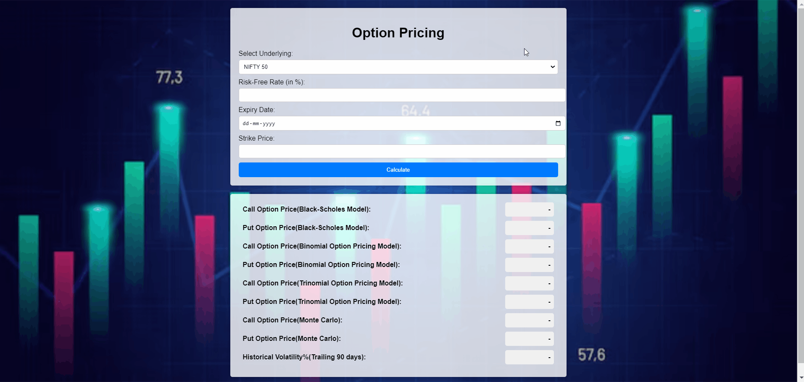

# Option Pricing Web Application

This is a web application that allows users to calculate the prices of European style call and put options of Indian Indices: NIFTY50 and BANKNIFTY in real-time using various pricing models, including Black-Scholes, Binomial, Trinomial, and Monte Carlo simulation.

## Table of Contents
1. [Project Overview](#project-overview)
2. [Technologies Used](#technologies-used)
3. [Function Descriptions](#function-descriptions)
   - [Backend (app.py)](#backend-apppf)
   - [Frontend (index.html, styles.css, script.js)](#frontend-indexhtmlstaticsscss-scriptjs)
4. [How to Run the Code](#how-to-run-the-code)
5. [Contribution](#contribution)
6. [Contributing](#contributing)
7. [Contact](#contact)

## Project Overview

This web application provides a user-friendly interface for calculating option prices. Users can input the underlying asset, strike price, expiry date, risk-free rate, and select the option type (call or put). The application then fetches the historical data for the underlying asset, calculates the spot price and historical volatility, and computes the option prices using the following models:

1. **Black-Scholes Model**: The Black-Scholes model is a widely used option pricing model that provides a closed-form solution for European-style options.
2. **Binomial Option Pricing Model**: The Binomial model uses a discrete-time approach to approximating the option price, with the number of time steps (n) set to 1000 in this implementation.
3. **Trinomial Option Pricing Model**: The Trinomial model is an extension of the Binomial model, using three possible price movements (up, down, and middle) at each time step.
4. **Monte Carlo Simulation**: The Monte Carlo simulation is a numerical method that generates a large number of possible future stock prices (50,000 in this case) and calculates the option payoff for each simulation, taking the average as the option price.

The calculated option prices are then displayed in the user interface.

## Technologies Used
- **Flask**: A Python web framework used for the backend server.
- **JavaScript**: Used for the client-side functionality, including form handling and AJAX requests.
- **HTML/CSS**: Used for the user interface design and styling.
- **NumPy**: A Python library used for numerical computations, including the Black-Scholes and Binomial option pricing formulas.
- **SciPy**: A Python library used for the normal cumulative distribution function in the Black-Scholes model.
- **yFinance**: A Python library used for fetching historical stock data.

## Function Descriptions

### Backend (app.py)

1. **fetch_historical_data(ticker_symbol, period='252d')**:
   - This function uses the `yfinance` library to fetch the historical closing prices for the given ticker symbol and time period.
   - It takes two parameters: `ticker_symbol` (the stock ticker) and `period` (the time period for which to fetch the data, defaulting to '252d' or 252 days).
   - The function returns the closing price data as a Pandas DataFrame if the data is successfully fetched, or `None` if an exception occurs.

2. **get_spot_price(underlying)**:
   - This function uses the `yfinance` library to fetch the current live price of the underlying asset.
   - It takes one parameter: `underlying` (the stock ticker for the underlying asset).
   - The function returns the current live price as a float if the price is successfully fetched, or `None` if an exception occurs.

3. **get_volatility(df)**:
   - This function calculates the historical volatility of the underlying asset based on the provided price data.
   - It takes one parameter: `df` (a Pandas DataFrame containing the historical closing prices).
   - The function first checks if the price data contains at least two values, as it's necessary to calculate the returns.
   - It then calculates the daily returns using the formula `returns = np.diff(price_data) / price_data[:-1]`.
   - The function then calculates the annualized volatility using the formula `volatility = np.std(returns) * np.sqrt(trading_days_per_year)`, where `trading_days_per_year` is set to 252.
   - The function returns the calculated volatility as a float if the calculation is successful, or `None` if an exception occurs.

4. **calculate_option_prices(S, K, T, r, sigma)**:
   - This function is responsible for calculating the option prices using the different pricing models.
   - It takes five parameters: `S` (the spot price), `K` (the strike price), `T` (the time to maturity), `r` (the risk-free rate), and `sigma` (the volatility).
   - The function calls the `black_scholes_call`, `black_scholes_put`, `binomial_option_pricing`, `trinomial_option_pricing`, and `monte_carlo_option_price` functions to calculate the respective option prices.
   - It returns the calculated option prices as a tuple: `(call_price_bs, put_price_bs, call_price_binomial, put_price_binomial, call_price_mc, put_price_mc, call_price_trinomial, put_price_trinomial)`.
   - If any exceptions occur during the calculations, the function returns `None` for the corresponding option prices.

5. **black_scholes_call(S, K, T, r, sigma)** and **black_scholes_put(S, K, T, r, sigma)**:
   - These functions implement the Black-Scholes formula for European-style call and put options, respectively.
   - They take the same five parameters as the `calculate_option_prices` function.
   - The functions calculate the `d1` and `d2` values using the formulas specified in the Black-Scholes model, and then use these values to calculate the call and put option prices.
   - The functions return the calculated option prices as floats.

6. **binomial_option_pricing(S, K, T, r, sigma, n)**:
   - This function implements the Binomial option pricing model for European-style options.
   - It takes six parameters: `S` (the spot price), `K` (the strike price), `T` (the time to maturity), `r` (the risk-free rate), `sigma` (the volatility), and `n` (the number of time steps, set to 1000 in this implementation).
   - The function calculates the up and down movements (`u` and `d`) and the risk-neutral probability (`p`) based on the given parameters.
   - It then initializes the stock price and option price matrices and uses a backward induction approach to compute the option prices at each node of the binomial tree.
   - The function returns the call and put option prices at the root of the tree (index `(0, 0)`).

7. **trinomial_option_pricing(S, K, T, r, dividend_yeild, sigma, trinomial_steps, option_type)**:
   - This function implements the Trinomial option pricing model for European-style options.
   - It takes eight parameters: `S` (the spot price), `K` (the strike price), `T` (the time to maturity), `r` (the risk-free rate), `dividend_yeild` (the dividend yield, set to 0 in this implementation), `sigma` (the volatility), `trinomial_steps` (the number of time steps, set to 1000 in this implementation), and `option_type` (either 'call' or 'put').
   - The function calculates the up, middle, and down movements, as well as the corresponding probabilities, based on the given parameters.
   - It then initializes the option price dictionary and sets the option prices at the maturity date based on the option type.
   - The function uses a backward induction approach to compute the option prices at each node of the trinomial tree.
   - The final option price is the value at the root of the tree (index `(0, 0)`).

8. **monte_carlo_option_price(S, K, T, r, sigma, option_type, num_simulations)**:
   - This function implements the Monte Carlo simulation for European-style options.
   - It takes seven parameters: `S` (the spot price), `K` (the strike price), `T` (the time to maturity), `r` (the risk-free rate), `sigma` (the volatility), `option_type` (either 'call' or 'put'), and `num_simulations` (the number of simulations, set to 100,000 in this implementation).
   - The function generates a large number of random stock price paths using the formula `stock_prices = S * np.exp((r - 0.5 * sigma ** 2) * dt + sigma * np.sqrt(dt) * rand)`.
   - It then calculates the option payoffs for each simulated stock price path, taking the maximum of `stock_prices - K` for call options and `K - stock_prices` for put options.
   - Finally, the function calculates the option price by taking the average of the payoffs and discounting it to the present value using the formula `option_price = np.exp(-r * T) * np.mean(payoffs)`.

9. **calculate_days_until_expiry(expiry_date)**:
   - This function calculates the number of days until the expiry date.
   - It takes one parameter: `expiry_date` (the expiry date in the format 'YYYY-MM-DD').
   - The function calculates the difference between the expiry date and the current date, and returns the number of days.
   - If an exception occurs during the calculation, the function returns `None`.

10. **calculate()**:
    - This is the main route in the Flask application that handles the user's request to calculate the option prices.
    - It takes the user input (underlying asset, strike price, expiry date, and risk-free rate) from the request JSON data.
    - The function then calls the other helper functions to fetch the historical data, calculate the spot price and volatility, and compute the option prices using the various pricing models.
    - Finally, it returns the calculated option prices as a JSON response.
    - If any exceptions occur during the calculation, the function returns a JSON response with an error message.

This covers the implementation details of each function in the backend (app.py) file.

### Frontend (index.html, static/styles.css, static/script.js)

1. `index.html`: The HTML template that provides the user interface for the application. It includes input fields for the user to enter the required parameters and output boxes to display the calculated option prices.
2. `styles.css`: The CSS file that defines the styles for the user interface, including the layout, colors, and animations.
3. `script.js`: The JavaScript file that handles the form submission, sends the AJAX request to the backend, and updates the output boxes with the calculated option prices.

## How to Run the Code

To run the Option Pricing Web Application, follow these steps:

1. Ensure you have Python (version 3.6 or higher) and the required dependencies installed:
   - Flask
   - NumPy
   - SciPy
   - yFinance
   - Flask-CORS

2. Clone the repository:
    git clone https://github.com/Aryan-Choudhari/option-pricing-app.git

3. Navigate to the project directory:
    cd option-pricing-app

4. Run the Flask application:
    python app.py

5. Open your web browser and navigate to `http://localhost:5000`. You should see the Option Pricing Web Application.

6. Use the input fields to enter the required parameters and click the "Calculate" button to see the option prices calculated using the different pricing models.

That's it! The Option Pricing Web Application is now running, and you can use it to calculate option prices based on the user's input.

## Contribution

The frontend to the project has been contributed to by Ayush Aswal(https://github.com/Ayush583-Aswal).

## Contributing

We welcome contributions to the Option Pricing Web Application project! If you'd like to contribute, please follow these guidelines:

1. Fork the repository and clone it to your local machine.
2. Create a new branch for your feature or bug fix: `git checkout -b feature/new-feature`.
3. Make your changes and test them thoroughly.
4. Commit your changes with descriptive commit messages: `git commit -m "Add new feature"`.
5. Push your changes to your fork: `git push origin feature/new-feature`.
6. Submit a pull request to the `main` branch of the original repository.

Please ensure that your code adheres to the project's coding standards and conventions. Also, provide a clear and detailed description of your changes in the pull request, along with any relevant documentation updates.

## Contact
If you have any questions, feel free to reach out at aryanchoudhari09@gmail.com.
